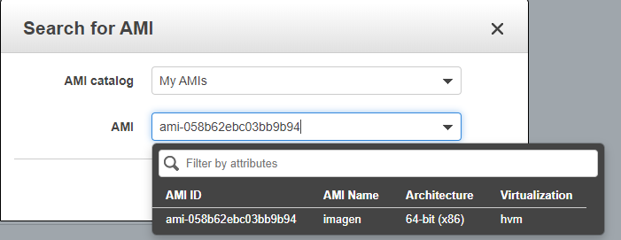

# Taller práctico de Disponibilidad y Desempeño

## Objetivo

Construya un taller que le permita a los ingenieros crear una solución autoescalable en EC2 y en la que puedan demostrar que 
el sistema efectivamente escala bajo condiciones determinadas de carga

## Desarrollo 

### 1. Idee un problema interesante que necesite una solución distribida y que necesite alto consumo de procesamiento, 
por ejemplo, ordenamiento de cadenas, indexación de grandes cantidades de texto, etc.. Genere los requerimientos mínimos.

### 2. Construya un prototipo de la solución.

El problema elegido es el ordenamiento de cadenas, se tiene un servicio web el cual se encarga de ordenar las cadenas que sean ingresadas. 

El problema de este servicio es que cuando hay muchas solicitudes, no se puede responder a todas. Esto por falta de procesamiento. Por esto se 
requiere que cuando las solicitudes superene la capacidad del servidor se cree una nueva instancia para soportar estas solicitudes.

Se construyo el prototipo de la solucion usando spark. Como se puede observar en la imagen se tiene una interfaz donde el usuario puede ingresar la 
lista de cadenas para que sean ordenadas alfabeticamente.  


### 3. Despliegue la solución en AWS en EC2.

Se desplega el servicio en una maquina EC2, como se puede observar a continuacion: 	


### 4. Configure la máquina para que inicie los servicios una vez se reinicia el servidor

Para configurar que el servicio se inicie con la maquina, utilice systemd el cual es una herramienta desarrollada por Red Hat la cual permite 
iniciar y detener servicios de la maquina. 

Primero se debe crear el servicio: 


En la variable ExecStart se indica el proceso a correr, se puede utilizar un script .sh o simplemente indicar el comando a ejecutar. 

Despues de esto se debe copiar este archivo en la direccion  /etc/systemd/system/

y otorgale permisos de ejecucion 


podemos ver con status que el programa se esta ejecutando en el background, ahora para que se ejecute cada vez que se inicie la maquina simplemente 
debemos ejecutar el comando

```linux
sudo systemctl enable myservice
``` 

ejecutamos el comando y debemos obtener la siguiente respuesta 


Ahora reiniciamos la maquina y al obtener el status de nuestro servicio este debe estar corriendo. 


### Cree un AMI a partir de esta máquina

Creamos una imagen de nuestra maquina 


#### creacion del template

Elegimos la imagen que creamos de nuestra maquina EC2 



Configuramos el id del AMI, seleccionamos amazon linux 2 ya que es el servicio gratis. Seleccionamos el tipo de instancia de la EC2 el cual 
es t2.micro y por ultimo elegimos las llaves para el acceso a la maquina. 


Despues de esto configuramos el vpc como se observa a continuacion 


Y finalizamos la creacion de nuestro template 


### creacion configuracion de lanzamiento 

Pasamos a configurar el lanzamiento, para esto debemos elegir el AMI. 


Elegimos el tipo de instancia, en nuestro caso es t2 micro. 


Configuramos el lanzamiento para que le asigne una ip publica a cada instancia


Y seleccionamos omitir para revisar

Ahora en review seleccionamos la opcion editar grupos de seguridad, esto para indicar los puertos por los que se tendra acceso a nuestra aplicacion


Despues de esto seleccionamos analisis y finalmente crear configuracion de lanzamiento. Aqui debemos elegir las llaves que usamos para el acceso a la
maquina EC2 


### creacion del grupo de auto escalamiento 

Despues de esto pasamos a crear el grupo de auto esacalamiento, como se observa en la imagen 


Ahora debemos configurar la politica de escalado para que cuando el consumo de cpu supere el 75% se cree una nueva instancia. 


Tambien anadimos una para reducir el tamano de las instancias cuando el consumo de CPU este por debajo del 25% durante 5 minutos.


Por ultimo creamos el grupo de escalamiento. 


### Monitoreo 

Comenzamos con una instancia de nuestra maquina como se puede observar en la imagen. 


Ahora mandamos las peticiones y esperamos que se cree una nueva instancia. 


Y como es de esperarse se crea una nueva instancia de nuestra maquina al superar el limite de uso de cpu que esta en 75% 


y si monitoreamos el performance la primera maquina podemos ver que efectivamente el uso de cpu llega a ese porcentaje y ahi se crea una nueva instancia


## Autor 

- Diego Alejandro Corredor Tolosa


 


